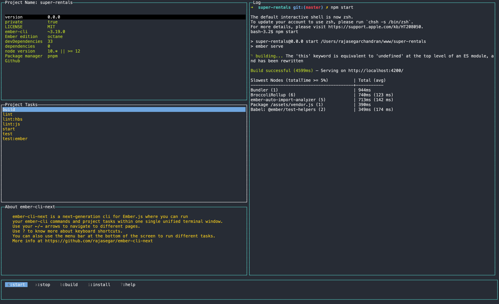
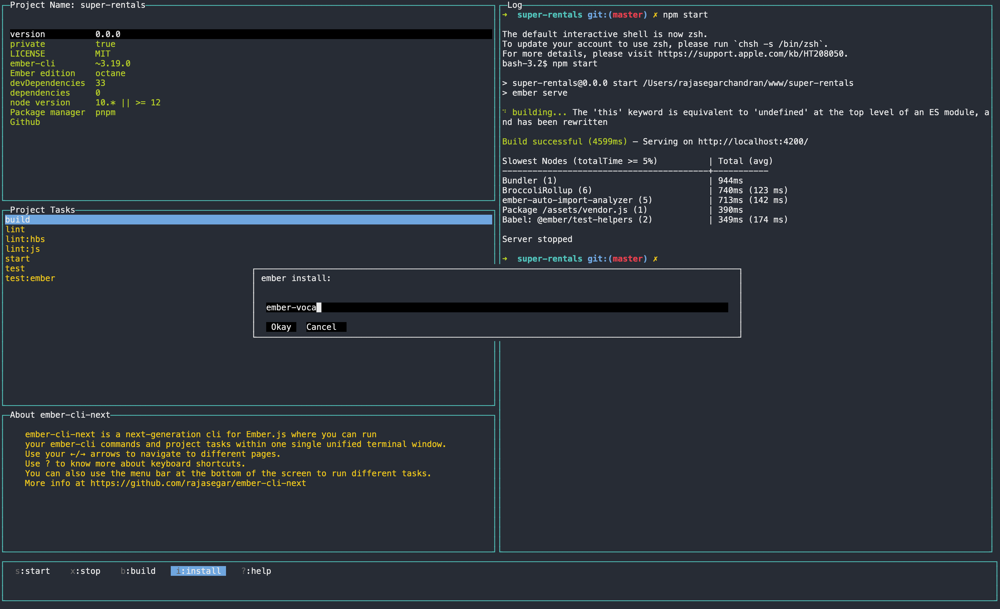
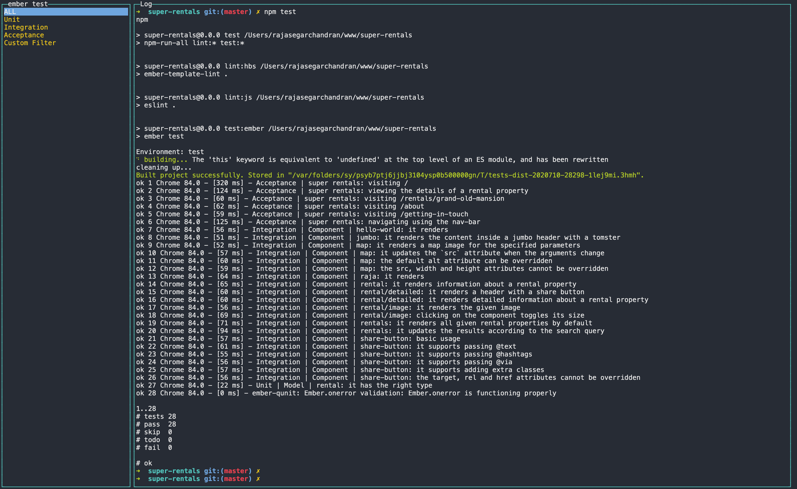
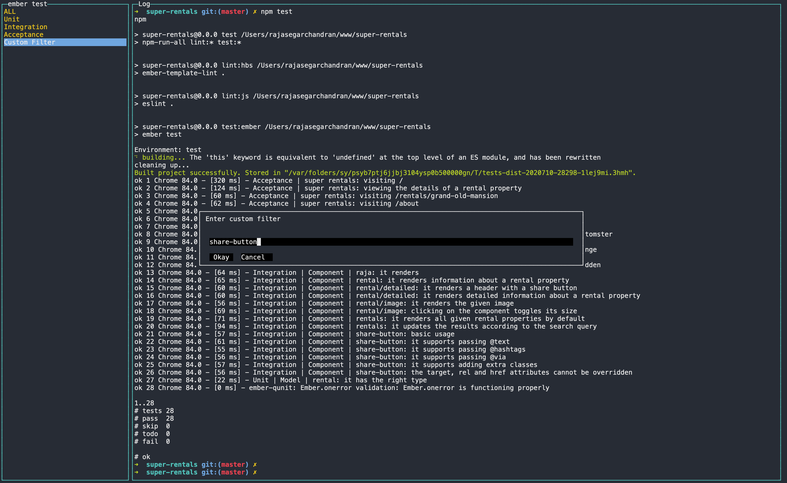
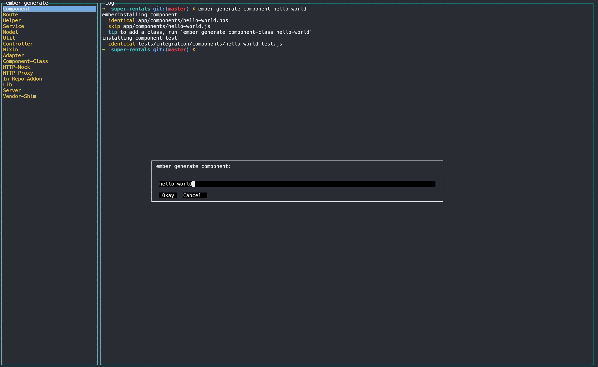

# ember-cli-next

[](https://github.com/semantic-release/semantic-release)
[](https://npmjs.org/package/ember-cli-next "View this project on npm")


Experimental Next generation TUI (terminal user interface) for ember-cli based on [blessed](https://github.com/chjj/blessed) and [blessed-contrib](https://github.com/yaronn/blessed-contrib),   where you can run your ember-cli commands and project tasks within one single unified terminal window.

## Install
```
npm install -g ember-cli-next
```

## Usage
```
ember-cli-next
```

## Demo
[ember-cli-next demo](https://www.youtube.com/watch?v=do9sRiOxenA)

## Screenshots

### Home Page


### Install Ember addons


### Run Tests


### Run tests with custom filters


### Generate Blueprints


## Keyboard shortcuts
```
    ['Next Page', 'Right Arrow'],
    ['Prev Page', 'Left Arrow'],
    ['Up', 'Up Arrow / k'],
    ['Down', 'Down Arrow / j'],
    ['Select', 'Enter / l'],
    ['Quit', 'Ctrl-q'],
    ['Install an addon', 'i'],
    ['Clear the terminal log', 'c'],
    ['Build project', 'b'],
    ['Go to the beginning of any list', 'gg'],
    ['Go to the end of any list', 'G'],
    ['Help', '? / !'],
    ['Navigate within a page', 'Tab'],
    ['Go to Home page', '0'],
    ['Go to Lint page', 'l'],
    ['Go to Tests page', 't'],
    ['Go to Generate page', 'g'],
    ['Go to Destroy page', 'd'],
    ['Go to Credits page', '9'],
```

